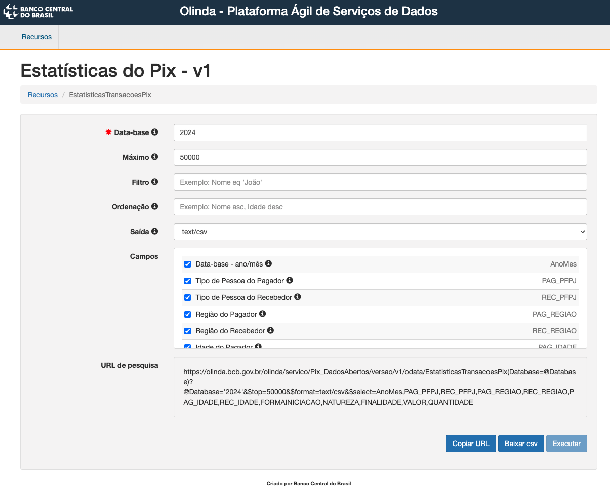
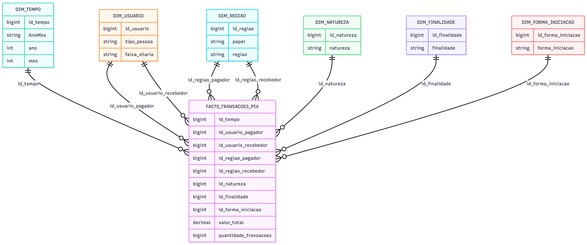
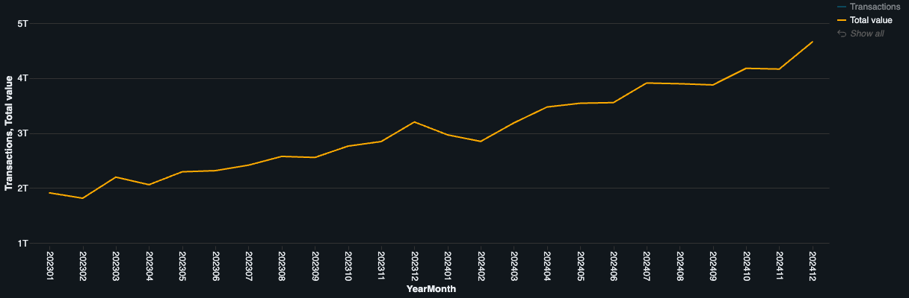
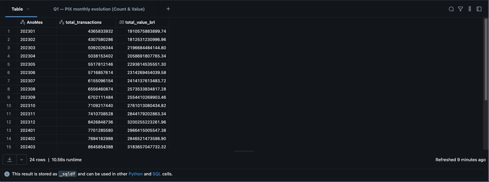
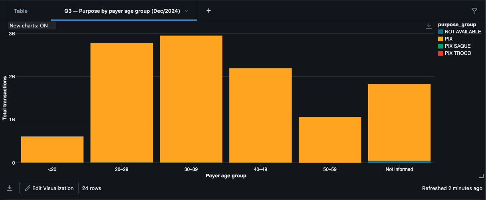
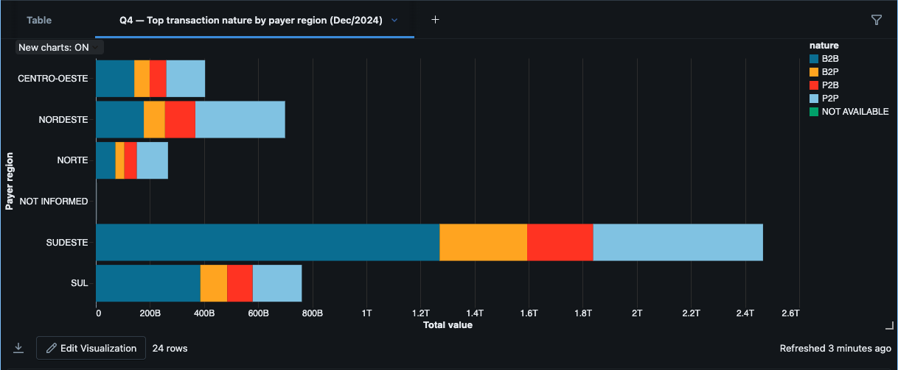
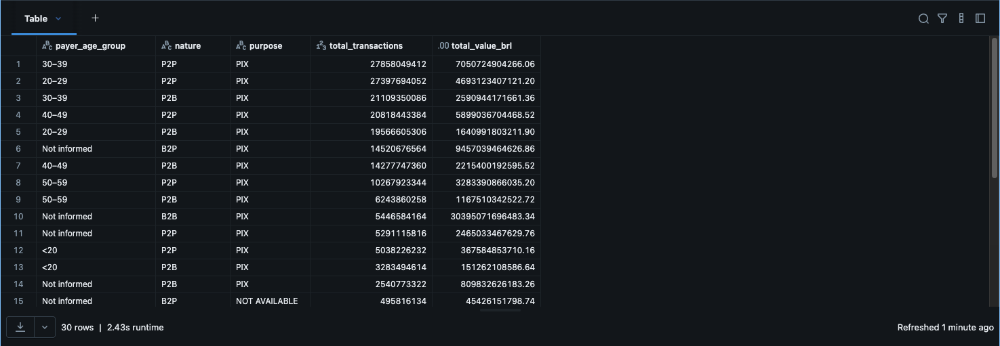
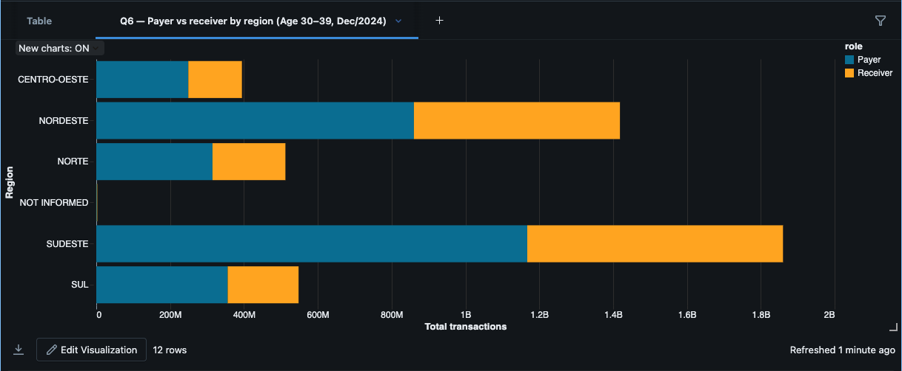
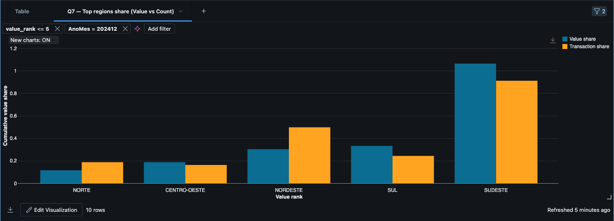

# Data Engineering MVP — PIX

## Summary

- [Data Engineering MVP — PIX](#data-engineering-mvp--pix)
  - [Summary](#summary)
  - [Overview](#overview)
  - [Project Context](#project-context)
  - [Objective](#objective)
  - [Business Questions](#business-questions)
  - [Dataset Used](#dataset-used)
  - [Data Pipeline Architecture](#data-pipeline-architecture)
    - [Bronze — Raw Data](#bronze--raw-data)
    - [Silver — Processed Data](#silver--processed-data)
    - [Gold — Analytical Model](#gold--analytical-model)
  - [Data Model (Gold)](#data-model-gold)
    - [Fact Table](#fact-table)
    - [Dimensions](#dimensions)
  - [Analytical Evidence (Business Questions)](#analytical-evidence-business-questions)
    - [Q1 — Monthly evolution and most active age groups](#q1--monthly-evolution-and-most-active-age-groups)
    - [Q2 — Payer vs receiver age-group interactions](#q2--payer-vs-receiver-age-group-interactions)
    - [Q3 — Transaction purpose by payer age group](#q3--transaction-purpose-by-payer-age-group)
    - [Q4 — Regional differences by transaction nature](#q4--regional-differences-by-transaction-nature)
    - [Q5 — Most common usage patterns (age × nature × purpose)](#q5--most-common-usage-patterns-age--nature--purpose)
    - [Q6 — Payer vs receiver profiles across regions](#q6--payer-vs-receiver-profiles-across-regions)
    - [Q7 — Regional concentration (value vs transaction count)](#q7--regional-concentration-value-vs-transaction-count)
  - [Data Quality and Validation](#data-quality-and-validation)
  - [Conclusion and Limitations](#conclusion-and-limitations)
  - [Self-Assessment](#self-assessment)
  - [Future Work](#future-work)
  - [Final Note](#final-note)
  - [Author](#author)

## Overview

This repository contains a **Data Engineering MVP** built to demonstrate an end-to-end analytical pipeline using public data from the Central Bank of Brazil related to the **PIX instant payment system**.

The project emphasizes:
- clear separation of data layers (Bronze → Silver → Gold),
- explicit analytical scope control,
- reproducible data quality checks,
- and transparent analytical limitations.

The goal is not to maximize technical complexity, but to deliver a **correct, explainable, and well-documented analytical pipeline**.

## Project Context

The MVP is framed in a public-sector context, with the **Central Bank of Brazil** as the primary data provider.

The analysis focuses on **aggregated PIX usage patterns**, exploring how transaction behavior varies over time, across user profiles, and between regions, using only officially published open data.

## Objective

Analyze PIX usage behavior using aggregated monthly data from the Central Bank of Brazil, identifying patterns by:

- age group,
- region,
- transaction nature,
- transaction purpose,
- payer vs receiver roles.

The project prioritizes analytical correctness and methodological clarity, supporting exploratory insights that could inform public-policy discussions.

## Business Questions

The following business questions guide the analytical exploration of this MVP:

1. Which age groups most frequently make PIX payments, and how does this pattern evolve over time?  
2. Are there relevant differences between payers and receivers in terms of age distribution and transaction volume?  
3. How does transaction purpose vary across different age groups?  
4. Are there regional differences in PIX usage considering transaction purpose, nature, and volume?  
5. Which combinations of age group, transaction nature, and transaction purpose represent the most common PIX usage patterns?  
6. How does the distribution of PIX usage differ between payer and receiver profiles across regions and age groups?  
7. How concentrated is PIX usage across regions when comparing total transaction value and transaction count?  
8. What is the income level of the most active PIX users?  
9. Do users primarily use PIX for essential or non-essential expenses?

## Dataset Used

**Source:** Central Bank of Brazil — PIX Open Data (Olinda API)

The analysis uses **aggregated monthly PIX statistics** for:

- **2023**
- **2024**

Each year was ingested separately (maximum 50,000 rows per extract) and stored as CSV files:

- `pix_2023.csv`
- `pix_2024.csv`

Although the raw files may contain records outside the target period, the analytical scope of this MVP was **explicitly restricted to January 2023 through December 2024**, enforced in the Silver layer.

## Data Pipeline Architecture

The pipeline follows a layered architecture:

### Bronze — Raw Data
Stores the original CSV files exactly as retrieved from the public API, enabling traceability and reprocessing.

### Silver — Processed Data
Applies:
- schema normalization,
- data type enforcement (e.g. monetary values as `decimal(18,2)`),
- categorical standardization,
- and strict scope filtering (2023–2024).

### Gold — Analytical Model
Implements a **star schema**, optimized for analytical queries and business exploration.

## Data Model (Gold)

The analytical model is implemented as a **star schema**, designed to support consistent aggregations and exploratory analysis.

Detailed documentation is available in the following files:
- 📘 **Star Schema Modeling:** [`docs/star_modeling.md`](docs/star_modeling.md)
- 📗 **Data Catalog and Domains:** [`docs/data_catalog.md`](docs/data_catalog.md)

### Fact Table
- `fato_transacoes_pix`  
  Aggregated monthly PIX activity with transaction count and total value.

### Dimensions
- `dim_tempo`
- `dim_usuario` (used for both payer and receiver)
- `dim_regiao` (role-aware: payer / receiver)
- `dim_natureza`
- `dim_finalidade`
- `dim_forma_iniciacao`

This structure supports temporal analysis, profile comparison, regional segmentation, and concentration studies.

---

## Analytical Evidence (Business Questions)

All analytical evidence was generated from the **Gold layer** using the notebook `05_analysis_questions_business`.

### Q1 — Monthly evolution and most active age groups

  
  

---

### Q2 — Payer vs receiver age-group interactions

---

### Q3 — Transaction purpose by payer age group

---

### Q4 — Regional differences by transaction nature

---

### Q5 — Most common usage patterns (age × nature × purpose)

---

### Q6 — Payer vs receiver profiles across regions

---

### Q7 — Regional concentration (value vs transaction count)

## Data Quality and Validation

Data quality validations were implemented in a dedicated notebook (`04_data_quality`) and executed across all pipeline layers (Bronze, Silver, and Gold).

The validation strategy focuses on **analytical correctness rather than exhaustive rule enumeration**, and includes:

- **Temporal scope validation**  
  Verification that all analytical tables are strictly restricted to the 2023–2024 period, including cross-checks between Silver data and the Gold time dimension.

- **Row count reconciliation across layers**  
  Comparative counts between Bronze, Silver, and Gold to ensure that transformations and aggregations behave as expected, without unintended data loss or duplication.

- **Data type enforcement**  
  Explicit validation that monetary values are stored as `decimal(18,2)` in the Silver and Gold layers, preventing floating-point inaccuracies.

- **Null and negative value checks**  
  Detection of unexpected nulls and invalid negative values in key analytical fields (transaction count and total value).

- **Domain validation in the Gold layer**  
  Verification that categorical domains (such as age groups) are enforced at the dimensional level, ensuring semantic consistency for analytical use.

- **Referential integrity checks**  
  Confirmation that all foreign keys in the Gold fact table are non-null and correctly mapped to their respective dimensions.

These checks collectively ensure that the analytical results presented in this MVP are **structurally sound, semantically consistent, and reproducible**.

## Conclusion and Limitations

This MVP successfully addressed **7 out of the 9 proposed business questions** using the available aggregated PIX dataset for the 2023–2024 period.

Two questions could not be answered within the current scope:

- **Income level of PIX users**  
  The dataset does not include income information or reliable proxies. Answering this question would require external socioeconomic enrichment (e.g. IBGE data).

- **Essential vs non-essential expenses**  
  While transaction nature and purpose are available, there is no official classification distinguishing essential from non-essential expenses. Addressing this question would require an explicit semantic classification layer.

These limitations stem from **source data constraints**, not from pipeline design.

## Self-Assessment

This project represented a significant learning challenge, particularly due to my first hands-on experience with Databricks as an end-to-end data engineering platform. One of the initial difficulties was related to data ingestion: I initially attempted to create tables directly instead of correctly configuring and using volumes, which led to execution issues and required revisiting fundamental platform concepts. Resolving this early mistake was an important step in understanding how Databricks manages storage, data access, and persistence across pipeline layers.

Throughout the development process, maintaining consistency across the Bronze, Silver, and Gold layers proved to be a continuous challenge. Enforcing data types, analytical scope, and semantic consistency required multiple iterations, especially when refining the Silver layer to properly support downstream analytical modeling. This reinforced the importance of the Silver layer as the point where business rules and data contracts must be explicitly enforced.

The use of Databricks’ built-in AI assistance played a meaningful role in accelerating development. It was particularly helpful for SQL formulation, schema inspection, and iterative refinement of transformations. While it did not replace critical thinking or design decisions, it proved to be an effective support tool when used deliberately and critically.

Another practical difficulty involved the generation of analytical visualizations. Some queries produced outputs that were not easily compatible with the Databricks visualization interface due to cardinality, dimensionality, or formatting constraints. As a result, several analyses required adjustments to favor clear tabular evidence over complex charts. This experience highlighted the importance of designing analytical outputs with the visualization medium in mind, especially in constrained environments.

Despite these challenges, the project successfully met its objectives. It enabled me to consolidate core data engineering concepts in practice, including layered architecture, data quality validation, dimensional modeling, and analytical scope management. More importantly, it strengthened my ability to reason about trade-offs, limitations, and design decisions in real-world data pipelines.

As a result, this MVP represents not only a functional technical deliverable, but also a concrete learning milestone in applying data engineering principles in a cloud-based analytical environment.

## Future Work

Potential extensions of this project include:

- Integration of external socioeconomic datasets (e.g., IBGE indicators) to enrich analytical capabilities.
- Expansion of the data quality framework with automated alerts and thresholds.
- Exploration of finer temporal granularity, such as daily or hourly data, if available.
- Development of interactive dashboards or geospatial analyses based on the existing Gold model.

These extensions would build upon the existing foundation without altering the core principles established in this MVP.

## Final Note

This MVP is based on **aggregated monthly data**, not transaction-level records.

All findings reflect **grouped behavioral patterns** and should be interpreted at an aggregate level.

The project emphasizes **pipeline correctness, analytical modeling, and transparent limitations**, aligning with the objectives of a data engineering MVP.

## Author
Vicente d'Avila Melo Sarmento
Pós-Graduação em Ciência de Dados & Analytics — PUC-Rio