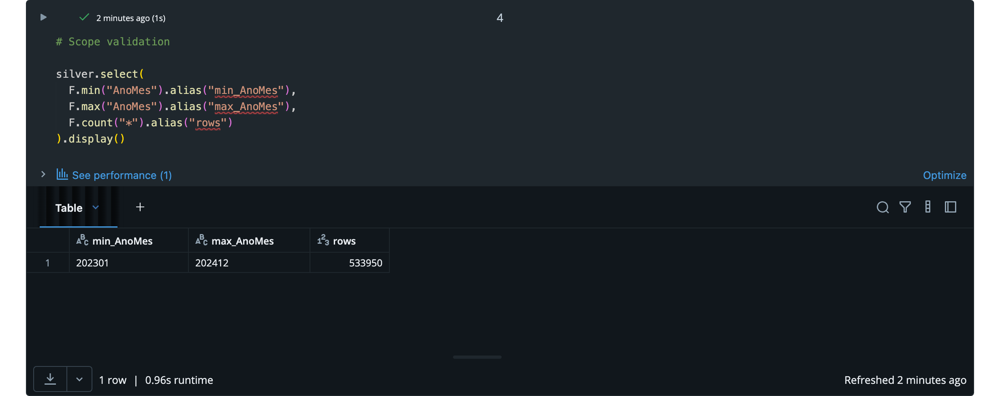
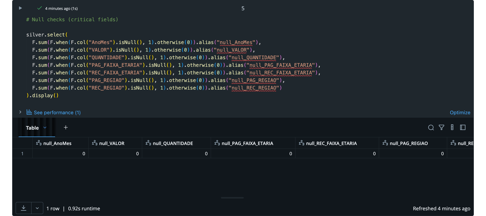
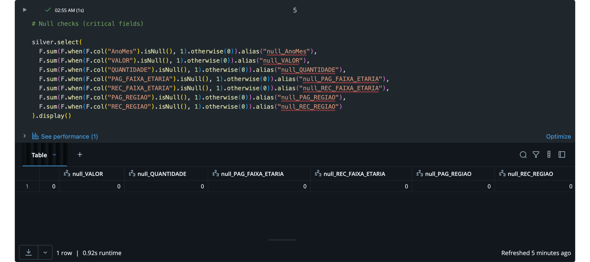
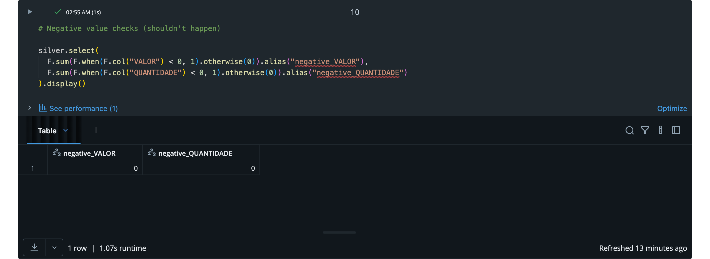
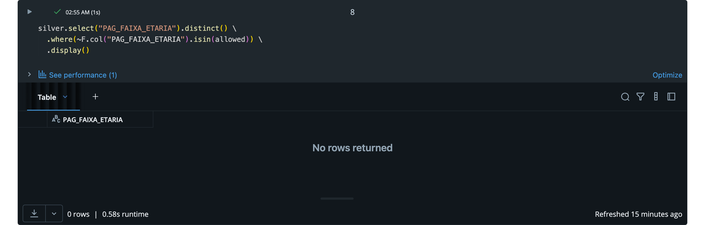
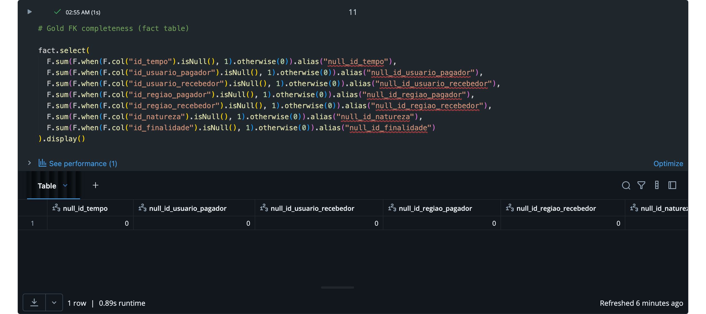
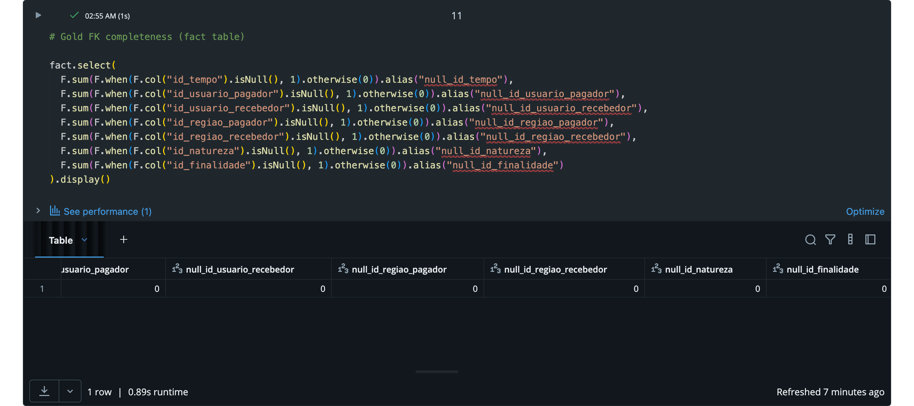

# Data Engineering MVP — PIX

## Overview

This repository contains the **Data Engineering MVP** developed for the Data Science and Analytics program. The objective is to build a complete cloud-based data pipeline using public data from the Central Bank of Brazil related to the PIX instant payment system.

The project prioritizes **clarity, organization, and end-to-end understanding**, focusing on a functional and well-documented pipeline rather than overly complex technical solutions.

## Project Context

The MVP is set in a governmental context, with the **Central Bank of Brazil** as the primary stakeholder. The analysis focuses on **PIX user behavior**, aiming to identify usage patterns over time, differences across user profiles, and regional variations.

Although it applies standard Data Engineering concepts and tools, the project was developed by a professional with a design background, emphasizing conceptual understanding, information organization, and data flow comprehension over advanced technical depth.

## Objective

Analyze PIX user behavior using open data from the Central Bank of Brazil, identifying usage patterns by age group, region, transaction nature, and purpose. The analysis explores differences between payer and receiver profiles and how these patterns evolve over time, supporting exploratory insights potentially relevant to public policy discussions.

## Business Questions

> Note: Some questions may require external enrichment beyond the PIX aggregated dataset. These will be addressed transparently in the conclusion section of the analysis notebook.


1. Which age groups most frequently make PIX payments, and how does this pattern evolve over time?  
2. Are there relevant differences between payers and receivers in terms of age and transaction volume?  
3. How does transaction purpose vary across different age groups?  
4. Are there regional differences in PIX usage considering purpose, nature, and volume?  
5. Which combinations of age, nature, and purpose represent the most common PIX usage patterns?  
6. What is the income level of the most active PIX users?  
7. Do users primarily use PIX for essential or non-essential expenses?

## Dataset Used

**Source:** Central Bank of Brazil — PIX Open Data (Olinda API)


API endpoint (example):
- Service: Pix_DadosAbertos / EstatisticasTransacoesPix
- Format: CSV
- Parameters: year (Database), select columns, top=50000

> https://olinda.bcb.gov.br/olinda/servico/Pix_DadosAbertos/versao/v1/odata/EstatisticasTransacoesPix(Database=@Database)?@Database='2024'&$top=50000&$format=text/csv&$select=AnoMes,PAG_PFPJ,REC_PFPJ,PAG_REGIAO,REC_REGIAO,PAG_IDADE,REC_IDADE,FORMAINICIACAO,NATUREZA,FINALIDADE,VALOR,QUANTIDADE

The analysis uses aggregated monthly data for **2023 and 2024**, max of 50,000 entries each, stored in two CSV files:

- `pix_2023.csv`  
- `pix_2024.csv`

Databricks Volumes were used to store the raw PIX files as ingested from the public API, preserving the original file structure and enabling controlled, repeatable processing into Bronze tables.

Although the original PIX files contain records outside the target period, the analytical scope of this MVP was explicitly constrained to transactions between January 2023 and December 2024. This filtering step was applied in the Silver layer to ensure consistency between the project objectives and the data effectively analyzed.


### Main columns used

- `AnoMes`  
- `PAG_IDADE`  
- `REC_IDADE`  
- `PAG_REGIAO`  
- `REC_REGIAO`  
- `NATUREZA`  
- `FINALIDADE`  
- `QUANTIDADE`  
- `VALOR`

Additional columns (`FORMA_INICIACAO`, `PAG_PFPJ`, `REC_PFPJ`) were retained for documentation and context only and were not used in the final analyses.

## Data Pipeline Architecture

The pipeline is organized into three layers:

### Bronze — Raw Data  
Stores the data exactly as obtained, without transformations, preserving the original source and enabling reprocessing.

### Silver — Processed Data  
Contains unified and standardized data, with adjusted data types and organized columns, prepared for analytical modeling.

### Gold — Analytical Model  
Provides the final analytical view, structured as a **star schema** with dimension tables and a fact table, enabling efficient querying and analysis.

## Data Model

The analytical model follows the **Star Schema** pattern and includes:

**Fact Table**
- `fato_transacoes_pix`

**Dimensions**
- `dim_tempo`  
- `dim_usuario` (used for both payer and receiver)  
- `dim_regiao` (with role distinction: payer or receiver)  
- `dim_natureza`  
- `dim_finalidade`  

This structure supports temporal analysis, user profile comparisons, and aggregations across multiple dimensions.

## Databricks Organization

The project uses **Unity Catalog** with the following structure:

- **Catalog:** `mvp_pix`  
- **Schema:** `bronze, silver, gold`  
- **Volume (Bronze):** `/Volumes/mvp_pix/dados/bronze/`

## Repository Structure
```
├── notebooks/
│ ├── 00_context_and_setup
│ ├── 01_bronze_ingestion_raw
│ ├── 02_silver_cleaning_standardization
│ ├── 03_gold_star_schema_modeling
│ ├── 04_data_quality
│ ├── 05_analysis_questions_business
│ └── 06_conclusion
├── docs/
│ ├── modelo_estrela
│ └── catalogo_dados
└── README.md
```

## Pipeline Validation and Evidence

This section presents execution and data quality evidence generated during the MVP development, supporting the correctness and consistency of the pipeline.

### Analytical Scope Validation (2023–2024)

The analytical scope was explicitly enforced in the Silver layer.  
The output below confirms that only records between January 2023 and December 2024 were kept.



### Core Data Quality Checks

Basic data quality validations were executed to ensure consistency of critical fields such as transaction value, quantity, age groups, and regions.








### Gold Layer Integrity

The Gold fact table was validated to ensure that all foreign keys were populated, confirming consistent joins with all dimensions.





## Final Note

This MVP represents a functional and well-documented data pipeline built with a focus on learning, clarity, and best practices. It does not aim to exhaust all analytical possibilities of the dataset, but to demonstrate a solid understanding of the complete data engineering process, from data collection to analysis.